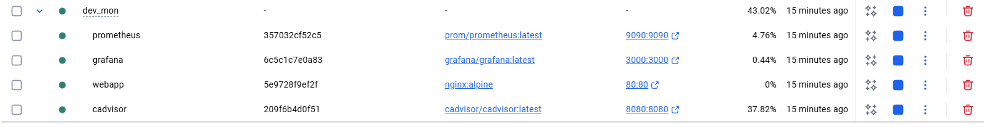
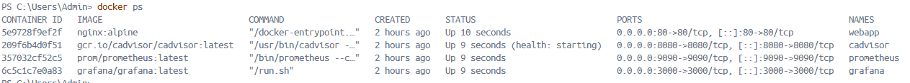
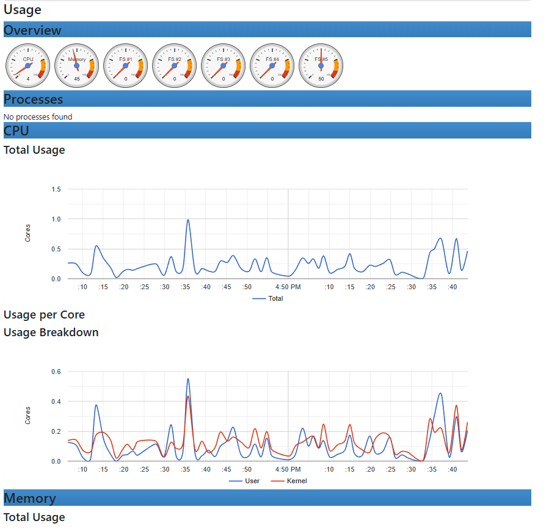
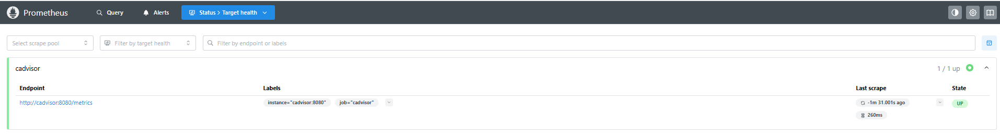
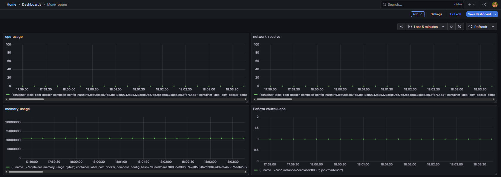
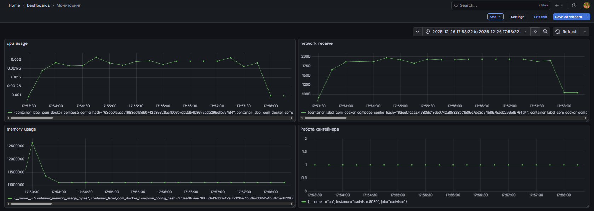

# Мониторинг Docker-контейнеров с помощью Grafana и Prometheus

Ягудин Ильдар ПИ-431Б

## Этап 1: Подготовка файлов конфигурации

1. Создали новую директорию для проекта

2. Создали файл docker-compose.yml с определением всех сервисов (webapp, cadvisor, prometheus, grafana)

3. Создали файл prometheus.yml для конфигурации Prometheus

---
## Этап 2: Запуск стека мониторинга

1. Запустили все контейнеры с помощью docker-compose

2. Проверили, что все контейнеры работают

---
## Этап 3: Проверка cAdvisor

1. Откройте веб-интерфейс cAdvisor в браузере

2. Убедились, что cAdvisor видит все контейнеры

3. Найшли в интерфейсе информацию о метриках контейнеров

## Этап 4: Проверка Prometheus

1. Открыли веб-интерфейс Prometheus

2. Проверили, что target cAdvisor имеет статус UP

3. Выполнили тестовый запрос:

## Этап 5: Подключение Grafana к Prometheus

1.Открыли веб-интерфейс Grafana

2. Добавили новый Data Source

## Этап 6: Создание простого дашборда для тестирования

1. Создали новый Dashboard

2. Добавили новые панели

3. Установили временной диапазон на "Last 5 minutes"

## Этап 7: Создание нагрузки на контейнер

1. Выполнили команду для генерации нагрузки на контейнер webapp

2. Наблюдали в реальном времени, как метрики изменяются на дашборде Grafana

## Этап 8: Анализ и отчёт

Скриншот без нагрузки:

Скриншот во время нагрузки

Во время нагрузки метрики значительно увеличивались  в сравнении с состоянием без нагрузки

